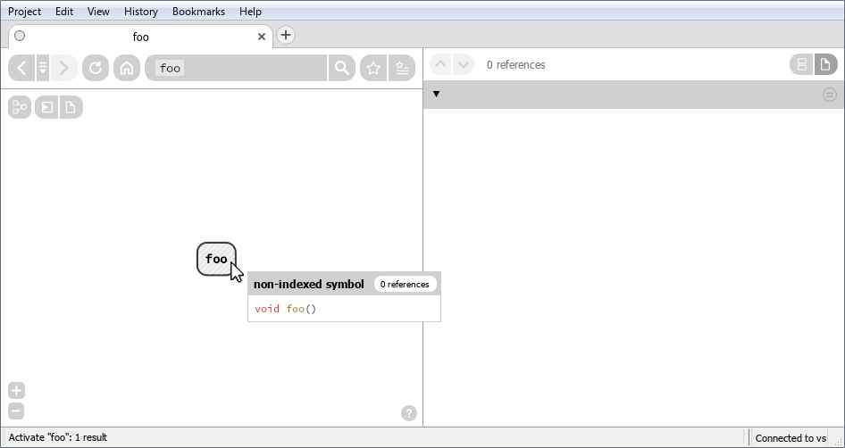
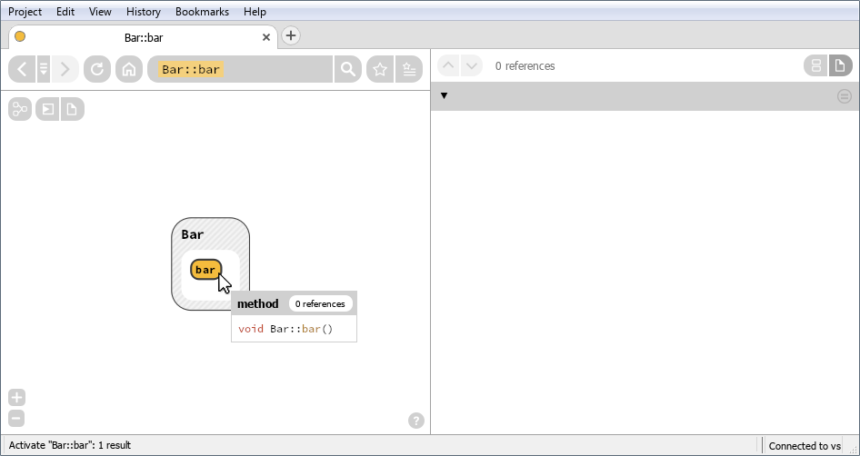
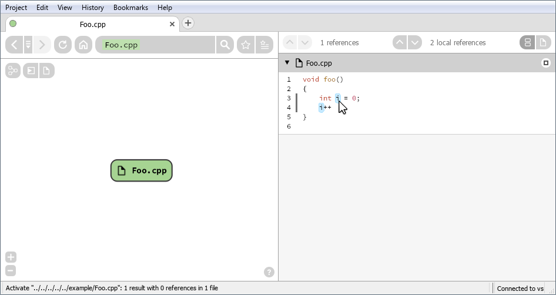

# SourcetrailDB

## CI Pipelines

Windows Builds: [](https://ci.appveyor.com/project/mlangkabel/sourcetraildb/branch/master)


## Introduction

The SourcetrailDB project provides write access to [Sourcetrail](https://www.sourcetrail.com/) database files. This means that you can use the SourcetrailDB project to write an indexer for an arbitrary programming language (or [other kind of data](TODO: maybe link to the poetry indexer sample here)) and make this indexer output a Sourcetrail database file that can be viewed and navigated via the Sourcetrail tool.


## Projects Using the SourcetrailDB
* TODO: reference Python project here


## Supported Languages

Note that even though the core of this project is written in C++, this does __not__ require you to write your indexer in C++ as well. Instead you can use the SourcetrailDB via one of our bindings for other languages. Currently bindings for the following languages are available:

* Python (via [SWIG](http://www.swig.org/))

If the language of your choice is not covered by this list, feel free to open an issue on the [issue tracker](https://github.com/CoatiSoftware/SourcetrailDB/issues) or even better: join us in our efforts on this project and provide a pull request!


## Writing to the Sourcetrail Database

The SourcetrailDB tries to keep the API for writing to the Sourcetrail database as simple as possible. For the C++ core take a look at the list of methods of the [SourcetrailDBWriter](https://github.com/CoatiSoftware/SourcetrailDB/blob/master/core/include/SourcetrailDBWriter.h) class for a complete overview of the provided write API. If you are using bindings for other languages, the code may look different but the set of provided functionality should stay the same. For now, let's jump right into action with some examples!


### Recording a Simple Symbol

```c++
sourcetrail::SourcetrailDBWriter writer;
writer.open("MyProject.srctrldb");

writer.recordSymbol({ "::",{ { "void", "foo", "()" } } }); // don't worry, this will syntax become clear in a minute

writer.close();
```




### Recording Additional Symbol Information

```c++
sourcetrail::SourcetrailDBWriter writer;
writer.open("MyProject.srctrldb");

sourcetrail::NameHierarchy name = { "::",{ { "void", "foo", "()" } } };
int symbolId = writer.recordSymbol(name);
assert(symbolId == writer.recordSymbol(name)); // recording a symbol multiple times will always return the same id
writer.recordSymbolDefinitionKind(symbolId, sourcetrail::DEFINITION_EXPLICIT); // makes the "non-indexed" go away
writer.recordSymbolKind(symbolId, sourcetrail::SYMBOL_FUNCTION); // turns the "symbol" into "function"

writer.close();
```


### Recording Nested Symbol Names

```c++
sourcetrail::SourcetrailDBWriter writer;
writer.open("MyProject_3.srctrldb");

sourcetrail::NameHierarchy name; // now lets look into names
name.nameDelimiter = "::"; // in many languages names can be nested - here you specify the delimiter string.

sourcetrail::NameElement parentElement;
parentElement.prefix = ""; // the prefix is just shown in the tooltip and can be omitted if not applicable
parentElement.name = "Bar"; // the name is shown in the graph and is prepended to the name of child a element
parentElement.postfix = ""; // the postfix is just shown in the tooltip and can be omitted if not applicable
name.nameElements.push_back(parentElement);

sourcetrail::NameElement childElement;
childElement.prefix = "void"; // tooltips omit prefixes of parents and only show the prefix of the hovered element
childElement.name = "bar";
childElement.postfix = "()"; // tooltips omit postfixes of parents and only show the prefix of the hovered element
name.nameElements.push_back(childElement);

int symbolId = writer.recordSymbol(name);
writer.recordSymbolDefinitionKind(symbolId, sourcetrail::DEFINITION_EXPLICIT);
writer.recordSymbolKind(symbolId, sourcetrail::SYMBOL_METHOD);

writer.close();
```




### Recording a Symbol's Location

```c++
sourcetrail::SourcetrailDBWriter writer;
writer.open("MyProject.srctrldb");

int symbolId = writer.recordSymbol({ "::",{ { "", "Bar", "" },{ "void", "bar", "()" } } });

int fileId = writer.recordFile("C:/example/Bar.cpp");  // path to the source file that contains the recorded location

sourcetrail::SourceRange location;
location.fileId = fileId;
location.startLine = 8; // recorded lines start at 1, not 0
location.startColumn = 7; // recorded columns start at 1, not 0
location.endLine = 8;
location.endColumn = 9;
writer.recordSymbolLocation(symbolId, location); // lets you click symbols in Sourcetrail's code view

writer.close();
```


### Recording References Between Symbols

```c++
sourcetrail::SourcetrailDBWriter writer;
writer.open("MyProject.srctrldb");

int contextSymbolId = writer.recordSymbol({ "::",{ { "", "Bar", "" },{ "void", "bar", "()" } } });
int referencedSymbolId = writer.recordSymbol({ "::",{ { "void", "foo", "()" } } });
int referenceId = writer.recordReference(contextSymbolId, referencedSymbolId, sourcetrail::REFERENCE_CALL); // edges always go from the context to the referenced symbol
int fileId = writer.recordFile("C:/example/Bar.cpp");
writer.recordReferenceLocation(referenceId, { fileId, 10, 3, 10, 5 }); // clicking an edge will highlight this locaion in the code view

writer.close();
```


### Recording File Information for Syntax Highlighting

```c++
sourcetrail::SourcetrailDBWriter writer;
writer.open("MyProject.srctrldb");

int fileId = writer.recordFile("C:/example/Bar.cpp");
writer.recordFileLanguage(fileId, "cpp"); // this enables syntax highlighting for predefined languages

writer.close();
```


### Recording Occurrences of Local Symbols

```c++
sourcetrail::SourcetrailDBWriter writer;
writer.open("MyProject.srctrldb");

int id = writer.recordLocalSymbol("some_unique_name"); // this name is just for referencing the symbol and won't be displayed anywhere
int fileId = writer.recordFile("C:/example/Foo.cpp");
writer.recordLocalSymbolLocation(id, { fileId, 3, 6, 3, 6 });
writer.recordLocalSymbolLocation(id, { fileId, 4, 2, 4, 2 });

writer.close();
```




### Recording Comments

```c++
sourcetrail::SourcetrailDBWriter writer;
writer.open("MyProject.srctrldb");

int fileId = writer.recordFile("C:/example/Bar.cpp");
int id = writer.recordCommentLocation({ fileId, 3, 2, 7, 4 }); // causes Sourcetrail to treat the source range as atomic - either display it completely or don't show it at all

writer.close();
```


### Recording Errors

```c++
sourcetrail::SourcetrailDBWriter writer;
writer.open("MyProject.srctrldb");

int fileId = writer.recordFile("C:/example/Foo.cpp");
std::string message = "Really? You missed that \";\" again?";
bool fatal = false;
sourcetrail::SourceRange location = { fileId, 4, 4, 4, 4 };
int id = writer.recordError(message, fatal, location); // store and show parsing and indexing errors

writer.close();
```


### Use Transactions for Speed

```c++
sourcetrail::SourcetrailDBWriter writer;
writer.open("MyProject.srctrldb");

writer.beginTransaction(); // wrapping your code in transactions really speeds up database operations

for (int i = 0; i < 1000; ++i)
{
	int id = writer.recordSymbol({ "::", { { "void", "foo" + std::to_string(i), "()" } } });
	if (id == 0) // something must have gone wrong because 0 is not a valid id
	{
		writer.rollbackTransaction(); // discard all the changes made within the transaction
		writer.close();
		return;
	}
}

writer.commitTransaction(); // don't forget to commit your transaction to persistently write the changes

writer.close();
```


## Building the SourcetrailDB Project

If you are unsure, just look at the [Appveyor (for Windows)](https://github.com/CoatiSoftware/SourcetrailDB/blob/master/appveyor.yml) or [Travis (for Mac and Linux)](https://github.com/CoatiSoftware/SourcetrailDB/blob/master/.travis.yml) CI scripts. But in general building the SourcetrailDB project is quite simple.


### The Core Target

The core project does not have any external dependencies you need to install, so just check out the project and run
```
$ mkdir build
$ cd build
$ cmake -G "<Your Generator>" ..
```

This will generate some build instructions that let you build the core library target and the test target. To run the tests, just execute the built executable.


### The Python Bindings Target

This target requires you to have the following software installed before configuring your CMake:
* [Python](https://www.python.org/) needs to be included and linked against when building the Python bindings. Usually CMake will auto-detect your Python installation. If you want to build against a specific version of Python, please define the `PYTHON_LIBRARY` variable accordingly when running CMake. Make sure to link to a 32 bit version of Python when building this target for a 32 bit architecture and use a 64 bit Python when bulding this target for a 64 bit architecture.
* [SWIG 3.0.12](http://www.swig.org/) is used to automatically generate Python binding code. Make sure that SWIG is added to your path environment variable.

If you want to build the Python bindings run:
```
$ mkdir build
$ cd build
$ cmake -G "<Your Generator>" -DBUILD_BINDINGS_PYTHON=ON ..
```

Swig is configured to generate the Python binding code as a pre-build event, so you don't need to bother with updating that part manually.
