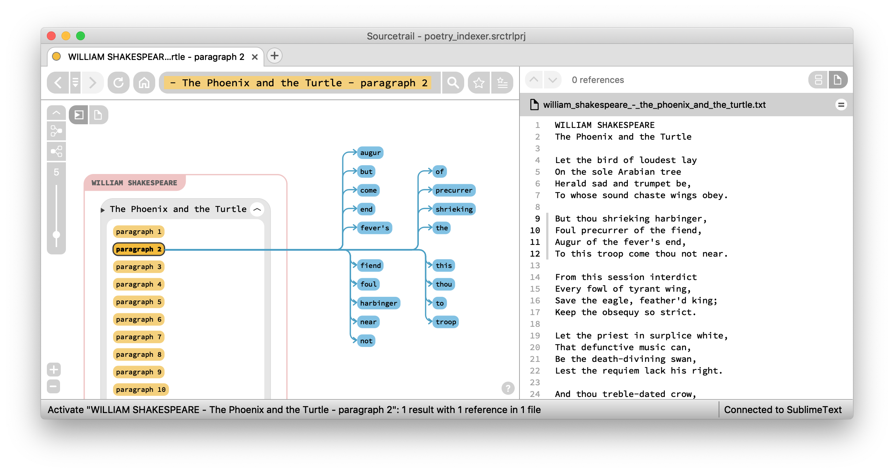
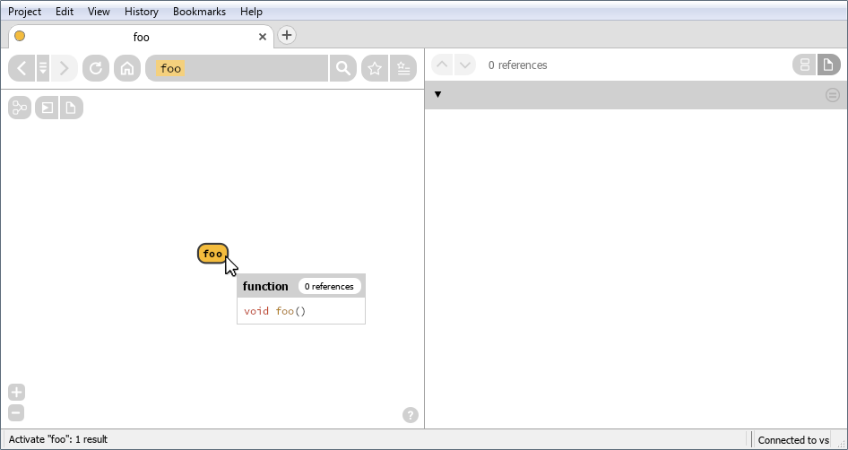
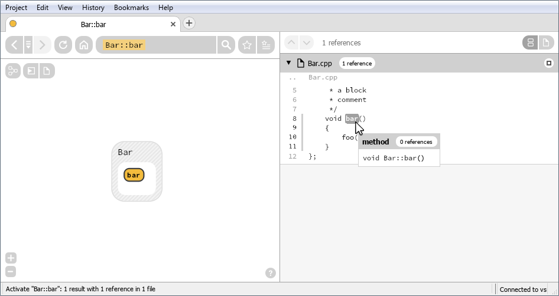
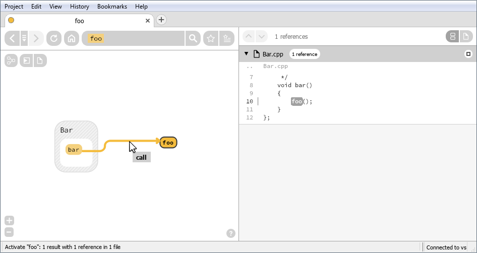
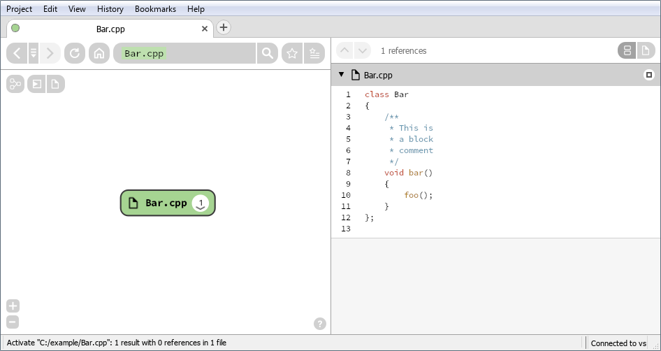
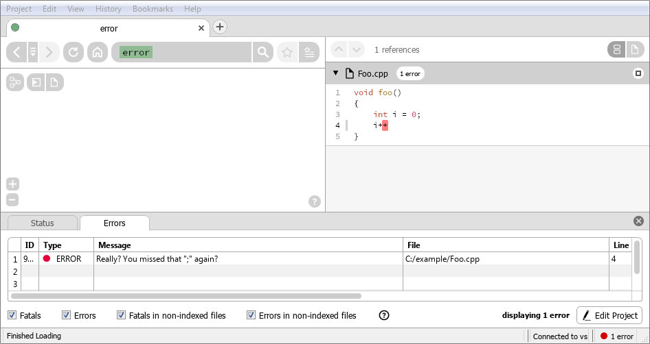
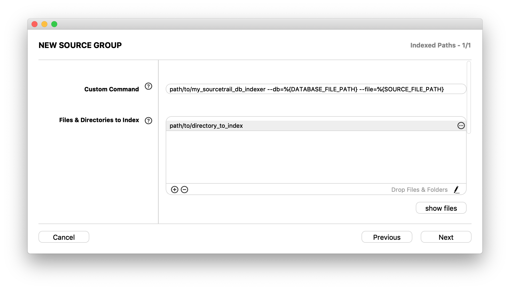

# SourcetrailDB
Library to export [Sourcetrail](https://www.sourcetrail.com/) compatible database files for writing custom indexers


## CI Pipelines

Windows: [](https://ci.appveyor.com/project/mlangkabel/sourcetraildb/branch/master)

Linux and macOS: [](https://travis-ci.org/CoatiSoftware/SourcetrailDB)


## Introduction

The SourcetrailDB project provides write access to [Sourcetrail](https://www.sourcetrail.com/) database files. You can use the SourcetrailDB project to write an indexer for an arbitrary programming language (or other kind of data, e.g. see [poetry indexer example](examples/cpp_poetry_indexer)) and export a Sourcetrail database file that can be viewed and navigated within Sourcetrail.




## Projects Using SourcetrailDB
* [SourcetrailPythonIndexer](https://github.com/CoatiSoftware/SourcetrailPythonIndexer)


## Supported Language Bindings

Even though the core implementation is written in C++, this does not require you to write your indexer in C++ as well. Instead you can use a language binding (e.g. see [SWIG](http://www.swig.org/)). These language bindings are already available:

* Python (via [SWIG](http://www.swig.org/))

If the language of your choice is not covered by this list, feel free to [open an issue](https://github.com/CoatiSoftware/SourcetrailDB/issues) or provide a pull request.


## Versioning

The SourcetrailDB version format consists of three numbers in the format `vXX.dbYY.pZZ`.
* `XX`: interface version. This version increases on every change that breaks backwards compatibility.
* `YY`: Sourcetrail database version. This version needs to match the database version of the used Sourcetrail instance. You can find the database version of Sourcetrail in its About dialog.
* `ZZ`: patch number of the build. It will increase with every release that publishes bugfixes and features that don't break any compatibility.

You can find a complete list of available releases on the [GitHub release page](https://github.com/CoatiSoftware/SourcetrailDB/releases). If you are interested in the actual changes of every release, please take a look at the [Changelog](CHANGELOG.md).


## Building

Take a look at [Appveyor (for Windows)](appveyor.yml) or [Travis (for Linux and macOs)](.travis.yml) CI scripts for reference.

### SourcetrailDB Core

Requirements:
* [CMake](https://cmake.org/) >= 2.6
* C++-Compiler with C++11 support

To build the SourcetrailDB core library `libsourcetraildb.a`:

```
$ cd path/to/SourcetrailDB
$ mkdir build
$ cd build
$ cmake ..
$ make lib_core
```

To run the tests, just build and execute the test executable:

```
$ make test_core
$ ./core/test_core
```

### Python Bindings

Requirements:
* [Python](https://www.python.org/) needs to be included and linked against when building the Python bindings. CMake will auto-detect your Python installation. If you want to build against a specific version of Python, please define the `PYTHON_LIBRARY` variable accordingly when running CMake. Make sure to link to the correct Python version when building for different architectures (32bit/64bit).

* [SWIG 3.0.12](http://www.swig.org/) is used to automatically generate Python binding code. Make sure that SWIG is added to your path environment variable.

If you want to build the Python bindings run:
```
$ cd path/to/SourcetrailDB
$ mkdir build
$ cd build
$ cmake -DBUILD_BINDINGS_PYTHON=ON ..
$ make _sourcetraildb
```

Swig is configured to generate the Python binding code as a pre-build event, so you don't need to bother with updating manually.

### Examples

The examples help you to understand SourcetrailDB usage in practice. Please take a look at each examples README file for build and use instructions. Each example also provides a Sourcetrail project file `.srctrlprj` showing you how to use a custom indexer directly from Sourcetrail (see [Integrating with Sourcetrail](#integrating-with-sourcetrail)).

* [C++ API Example](examples/cpp_api_example)
* [C++ Poetry Indexer](examples/cpp_poetry_indexer)
* [Python API Example](examples/python_api_example)


## SourcetrailDB API

SourcetrailDB tries to keep the API for writing to the Sourcetrail database as simple as possible. For the C++ core take a look at the list of methods of the [SourcetrailDBWriter](core/include/SourcetrailDBWriter.h) class for a complete overview of the provided write API. If you are using bindings for other languages, the code may look different but the set of provided functionality should stay the same.


### Opening or Creating a Database

```c++
// create an instance of SourcetrailDBWriter
sourcetrail::SourcetrailDBWriter writer;

// open a database connection by passing a database file path (.srctrldb or .srctrldb_tmp)
// if the database file does not exist yet, it will be created in this location.
// a project file (.srctrlprj) will also be created, if it does not exist in this location.
writer.open("MyProject.srctrldb");

// record data...

// close the database connection.
writer.close();
```

### Recording a Symbol

```c++
sourcetrail::SourcetrailDBWriter writer;
writer.open("MyProject.srctrldb");

// records a named non-indexed symbol without type
writer.recordSymbol({ "::", { { "void", "foo", "()" } } });

writer.close();
```


### Recording Additional Symbol Information

```c++
sourcetrail::SourcetrailDBWriter writer;
writer.open("MyProject.srctrldb");

sourcetrail::NameHierarchy name = { "::", { { "void", "foo", "()" } } };

// the returned symbolId will be used to record further information for the symbol
int symbolId = writer.recordSymbol(name);

// recording a unique name multiple times will always return the same symbol id
assert(symbolId == writer.recordSymbol(name));

// set symbol "explicit" to remove the "non-indexed" state.
writer.recordSymbolDefinitionKind(symbolId, sourcetrail::DEFINITION_EXPLICIT);

// set type to turn the symbol into "function"
writer.recordSymbolKind(symbolId, sourcetrail::SYMBOL_FUNCTION);

writer.close();
```




### Recording Nested Symbol Names

```c++
sourcetrail::SourcetrailDBWriter writer;
writer.open("MyProject_3.srctrldb");

// create a name hierarchy
sourcetrail::NameHierarchy name;

// specify the delimiter string - in many languages names can be nested
name.nameDelimiter = "::";

// add a name element for the parent
sourcetrail::NameElement parentElement;
parentElement.prefix = ""; // only shown in tooltip of the parent symbol
parentElement.name = "Bar";
parentElement.postfix = ""; // only shown in tooltip of the parent symbol
name.nameElements.push_back(parentElement);

// add a name element for the child
sourcetrail::NameElement childElement;
childElement.prefix = "void"; // only shown in tooltip
childElement.name = "bar";
childElement.postfix = "()"; // only shown in tooltip
name.nameElements.push_back(childElement);

// recording a name hierarchy with multiple elements automatically creates parent symbols, if still unknown
int childId = writer.recordSymbol(name);
writer.recordSymbolDefinitionKind(childId, sourcetrail::DEFINITION_EXPLICIT);
writer.recordSymbolKind(childId, sourcetrail::SYMBOL_METHOD);

writer.close();
```


### Recording Symbol Location

```c++
sourcetrail::SourcetrailDBWriter writer;
writer.open("MyProject.srctrldb");

int symbolId = writer.recordSymbol({ "::", { { "", "Bar", "" }, { "void", "bar", "()" } } });

// record a file via it's absolute path
int fileId = writer.recordFile("C:/example/Bar.cpp");

// create a location
sourcetrail::SourceRange location;
location.fileId = fileId;
location.startLine = 8; // lines start at 1, not 0
location.startColumn = 7; // columns start at 1, not 0
location.endLine = 8;
location.endColumn = 9;

// adds a clickable location to the file for the specified symbol
writer.recordSymbolLocation(symbolId, location);

// the whole scope location will be visible and highlighted when the symbol is active
writer.recordSymbolScopeLocation(symbolId, { fileId, 8, 1, 11, 1 });

writer.close();
```




### Recording References Between Symbols

```c++
sourcetrail::SourcetrailDBWriter writer;
writer.open("MyProject.srctrldb");

int contextSymbolId = writer.recordSymbol({ "::", { { "", "Bar", "" }, { "void", "bar", "()" } } });
int referencedSymbolId = writer.recordSymbol({ "::", { { "void", "foo", "()" } } });

// edges always go from the context to the referenced symbol
int referenceId = writer.recordReference(contextSymbolId, referencedSymbolId, sourcetrail::REFERENCE_CALL);

// add a location to the reference - highlights the location in the code view when clicking the edge in the graph view
int fileId = writer.recordFile("C:/example/Bar.cpp");
writer.recordReferenceLocation(referenceId, { fileId, 10, 3, 10, 5 });

writer.close();
```




### Recording File Information for Syntax Highlighting

```c++
sourcetrail::SourcetrailDBWriter writer;
writer.open("MyProject.srctrldb");

int fileId = writer.recordFile("C:/example/Bar.cpp");

// enable syntax highlighting using a <language>.rules file loaded from Sourcetrail's data directory
writer.recordFileLanguage(fileId, "cpp");

writer.close();
```




### Recording Local Symbols

```c++
sourcetrail::SourcetrailDBWriter writer;
writer.open("MyProject.srctrldb");

// provide a unique local symbol name - the name is not displayed anywhere
int localId = writer.recordLocalSymbol("some_unique_name");
int fileId = writer.recordFile("C:/example/Foo.cpp");
writer.recordLocalSymbolLocation(localId, { fileId, 3, 6, 3, 6 });
writer.recordLocalSymbolLocation(localId, { fileId, 4, 2, 4, 2 });

writer.close();
```


### Recording Comments

```c++
sourcetrail::SourcetrailDBWriter writer;
writer.open("MyProject.srctrldb");

int fileId = writer.recordFile("C:/example/Bar.cpp");

// the recorded source range is atomic - it is always shown completely
int id = writer.recordCommentLocation({ fileId, 3, 2, 7, 4 });

writer.close();
```


### Recording Errors

```c++
sourcetrail::SourcetrailDBWriter writer;
writer.open("MyProject.srctrldb");

int fileId = writer.recordFile("C:/example/Foo.cpp");

// store and show parsing and indexing errors
std::string message = "Really? You missed that \";\" again?";
bool fatal = false;
sourcetrail::SourceRange location = { fileId, 4, 4, 4, 4 };
int id = writer.recordError(message, fatal, location);

writer.close();
```




### Use Transactions for Speed

```c++
sourcetrail::SourcetrailDBWriter writer;
writer.open("MyProject.srctrldb");

// wrapping your code in transactions really speeds up database operations
writer.beginTransaction();

for (int i = 0; i < 1000; ++i)
{
	int id = writer.recordSymbol({ "::", { { "void", "foo" + std::to_string(i), "()" } } });
	if (id == 0) // if something goes wrong
	{
		// discard all the changes made within the transaction
		writer.rollbackTransaction();
		writer.close();
		return;
	}
}

// don't forget to commit your transaction to persistently write the changes
writer.commitTransaction();

writer.close();
```

## Integrating with Sourcetrail

Applications using SourcetrailDB can be directly integrated with Sourcetrail by creating a project with a **Custom Command Source Group**. Choose `Custom` in the project selection dialog:


### Project Setup

A Custom Command Source Group defines:

* **Custom Command**: This command will be executed for each source file in the source group. You can pass these variables in the command:
	- **%{SOURCE_FILE_PATH}**: The path to each source file in the source group
	- **%{DATABASE_FILE_PATH}**: The path to the database of the project
	- **%{DATABASE_VERSION}**: The database version of the used Sourcetrail instance
	- **%{PROJECT_FILE_PATH}**: The path to the project file
* **Files & Directories to Index**: Paths to search for source files.
* **Excluded Files & Directories**: Files and directories within the above, that should not be indexed.
* **Source File Extensions**: The extension of the source files. Extension is ignored if left empty.




### Indexing

Indexing the project works as usual, the specified **Custom Command** is executed with each source file passed in **%{SOURCE_FILE_PATH}**. The files in the **Custom Command Source Group** will be indexed after all other files.


